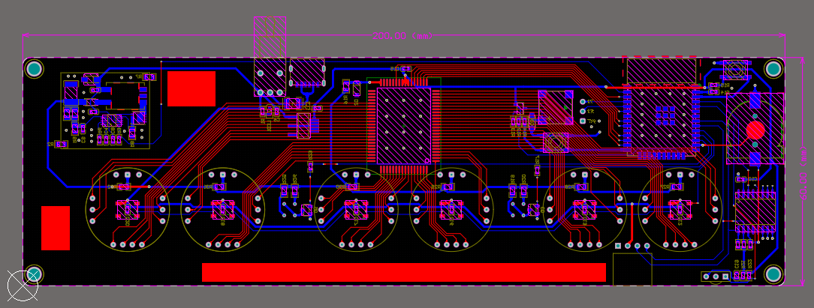
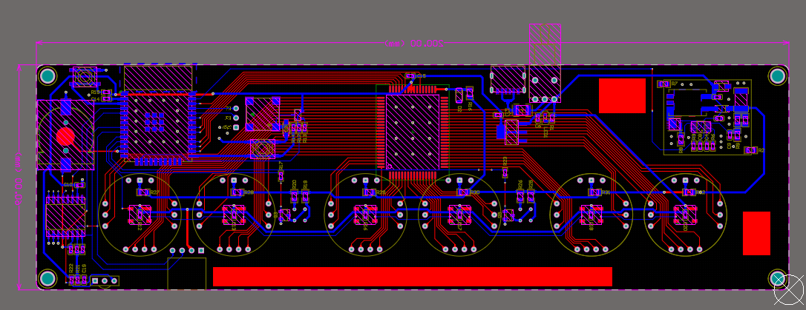
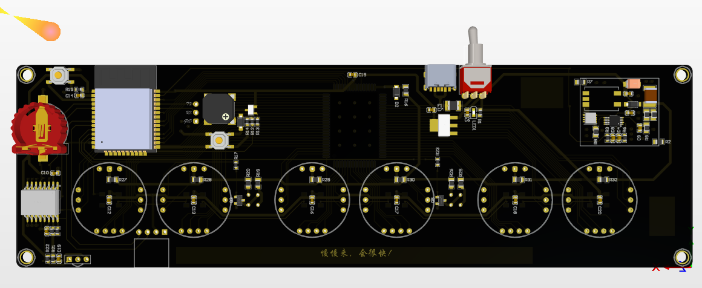
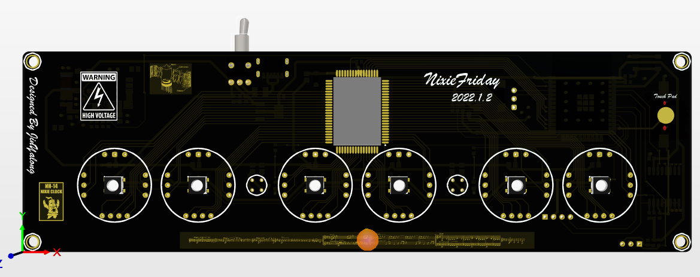

# NixieFriday

日志：www.codefriday.cn

Nixie tubes clock with six IN-14

DIY成本预计在1k左右~，有170V电压，无电子基础的！

电阻容封装统一采用0603

# 简单介绍

## 硬件

硬件部分由Altium Designer20.0设计

主要分为以下模块：

+ Power：Type输出5V，降压输出3.3V为芯片等供电
+ Boost电路：5V升压170V电路（超小体积，效率理论在85以上）
+ Buzzer：蜂鸣器模块，提供一些类似于闹钟发声的功能
+ RTC模块：使用一颗DS3231SN实时时钟芯片，精准走时，一年误差一分钟
+ MCU：ESP32-Wroom-E 16MB，板载天线，自带wifi蓝牙
+ 红外接收：VS1838B
+ 冒号管：4mm氖泡
+ RGB背光：WS2812C/W 

+ 辉光管显示：来自83年一月份生产同批CCCP&OTK认证的IN-14全新辉光管6支
+ OLED显示屏：0.96英寸，128x64

3D渲染图：

## 软件

软件部分采用了MicroPython驱动硬件，基本和python语法一样，软件部分等待完善后开源

